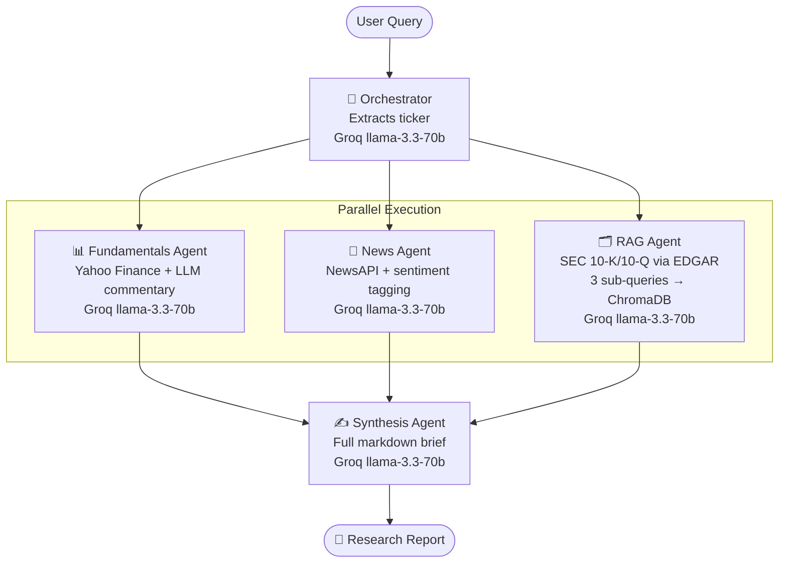

# Financial Research Multi-Agent System

A multi-agent pipeline that produces structured equity research briefs by combining live fundamentals, recent news, and SEC filing analysis.

---

## Architecture



**Data sources:**
| Agent | Source | What it fetches |
|---|---|---|
| Fundamentals | Yahoo Finance (yfinance) | Market cap, P/E, EPS, revenue, sector |
| News | NewsAPI | Latest 5 headlines with sentiment |
| RAG | SEC EDGAR | Latest 10-K or 10-Q chunked into ChromaDB |

---

## Setup

```bash
git clone <repo>
cd fin-research-agents
python -m venv .venv && source .venv/bin/activate
pip install -e .
```

Create a `.env` file in the project root:

```env
GROQ_API_KEY=your_groq_key
GOOGLE_API_KEY=your_google_ai_studio_key
NEWSAPI_KEY=your_newsapi_key
SEC_USER_AGENT=FirstName LastName your@email.com
HF_TOKEN=your_huggingface_token        # optional, avoids rate limits
```

---

## CLI

### Analyze a company

```bash
fin-research analyze "Is Tesla a good buy right now?"
fin-research analyze "What are Nvidia's AI risks?"
fin-research analyze "Summarize Microsoft's cloud business"
```

The first query for a new company auto-ingests its SEC filing automatically.

### Ingest SEC filings manually

```bash
# Ingest one or more tickers (one-time per ticker)
fin-research ingest AAPL
fin-research ingest TSLA NVDA MSFT

# Re-ingest after a new quarterly filing is released
fin-research ingest NVDA --refresh
fin-research ingest AAPL TSLA --refresh
```

> **Note:** Ingestion is a one-time operation per ticker. Data persists in `chroma_db/` on disk. Only re-ingest when a new 10-K or 10-Q is filed.

---

## MCP Server (Claude Desktop)

The MCP server exposes two tools directly to Claude Desktop or any MCP client:

| Tool | Description |
|---|---|
| `research_company(query)` | Runs the full pipeline and returns a markdown report |
| `ingest_company(ticker, refresh?)` | Ingests or refreshes SEC filing data |

### Connect to Claude Desktop

Add to `~/.claude/claude_desktop_config.json`:

```json
{
  "mcpServers": {
    "fin-research": {
      "command": "/path/to/fin-research-agents/.venv/bin/python",
      "args": ["-m", "fin_agents.mcp_server"],
      "env": {
        "GROQ_API_KEY": "...",
        "GOOGLE_API_KEY": "...",
        "NEWSAPI_KEY": "...",
        "SEC_USER_AGENT": "..."
      }
    }
  }
}
```

Restart Claude Desktop. You can then ask Claude directly:
> *"Analyze Nvidia's AI outlook"*
> *"What are Apple's biggest risks according to their latest 10-K?"*

### Run MCP server standalone

```bash
python -m fin_agents.mcp_server
```

---

## Output format

Every report is structured markdown with six sections:

```
## Executive Summary
## Key Financials
## Recent News
## Filings Insights
## Risks
## Analyst Takeaway
```

---

## Project structure

```
src/fin_agents/
├── data/
│   ├── fundamentals.py   # Yahoo Finance via yfinance
│   ├── news.py           # NewsAPI
│   └── filings.py        # SEC EDGAR 10-K/10-Q
├── rag/
│   ├── ingest.py         # Chunk + embed + store in ChromaDB
│   └── retriever.py      # Query ChromaDB by ticker + sub-query
├── agents/
│   ├── state.py          # ResearchState TypedDict
│   ├── orchestrator.py   # Ticker extraction
│   ├── fundamentals_agent.py
│   ├── news_agent.py
│   ├── rag_agent.py
│   ├── synthesis_agent.py
│   └── graph.py          # LangGraph parallel fan-out
├── cli.py                # Typer CLI
└── mcp_server.py         # FastMCP server
```
